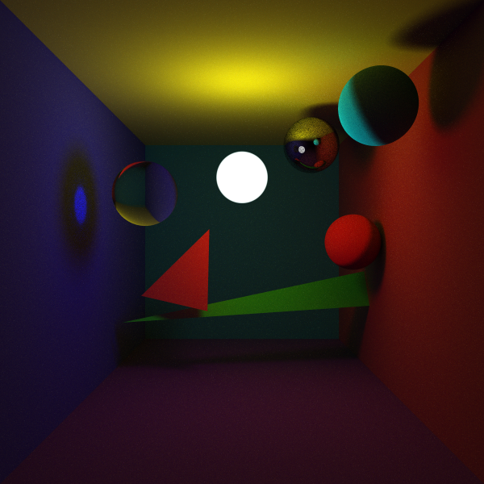
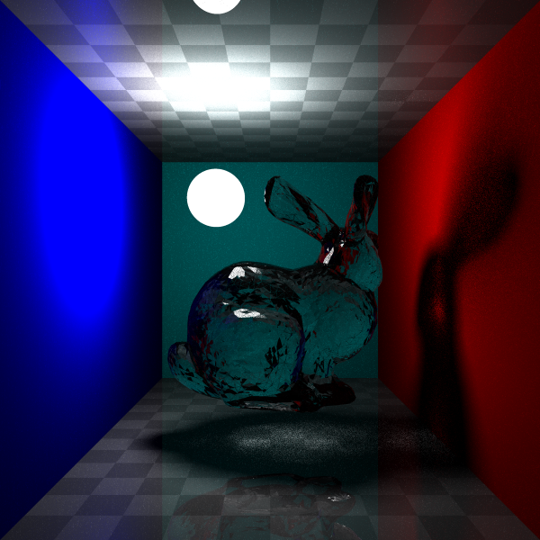
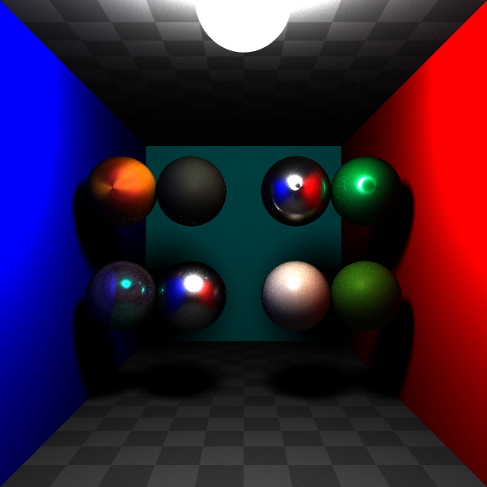

RayTracer

中文版说明[点击这里](readme_cn.md)


Suppose you are in the root directory of this project.

Then:

1.make a new folder named "build".

```
mkdir build
```

2.enter this folder.

```
cd build
```

3.generate the project with cmake.

```
cmake ..
cmake --build .
cmake --install .
```

4.then an .exe file named ray_tracer.exe will be generated in the bin folder.

5.after running the program, an image named "img.png" will be created which represents the rendering result.

6.you can change the scene by changing the code in config.cpp.

eg:

    SceneType configScene = SceneType::ROOM_TEAPOT;

7.Because the rendering process is time-consuming, you can change the resolution of the image by changing the value resolutionScale and configSamplersPerPixel in config.cpp.

eg: 
    
    
    int resolutionScale = 16;//this is slow but with more resolution
    int configSamplersPerPixel = 10;//this is slow but with more sapplers
---
    int resolutionScale = 2;//this is fast but with less resolution
    int configSamplersPerPixel = 1;//tis is fast but with less samplers


you can get some details in the document folder.(in progressing...)

reference: https://pbr-book.org/4ed/contents

---

---

---

---