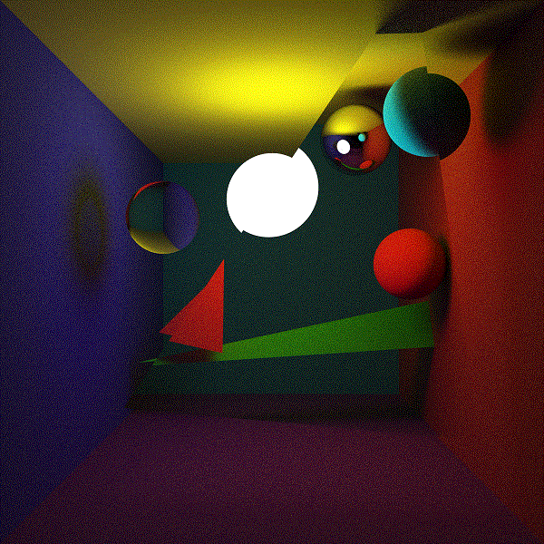
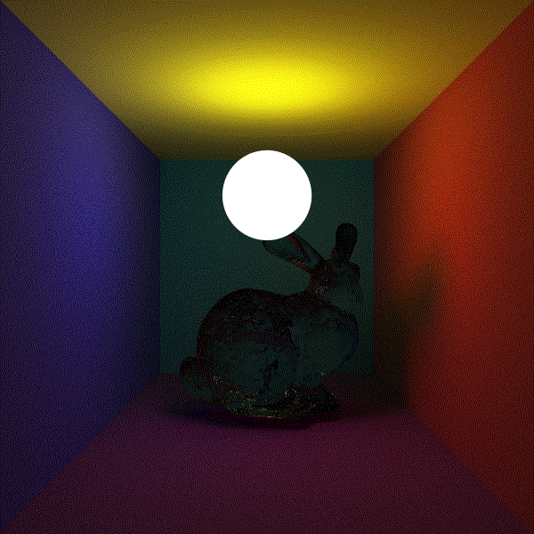

RayTracer
---


Suppose you are in the root directory of this project.

Then:

1.make a new folder named "build".

```
mkdir build
```

2.enter this folder.

```
cd build
```

3.generate the project with cmake.

```
cmake ..
cmake --build .
cmake --install .
```

4.then an .exe file named ray_tracer.exe will be generated in the bin folder.

5.after running the program, an image named "img.png" will be created which represents the rendering result.


you can get some details in the document folder.(in progressing...)


---

---

---