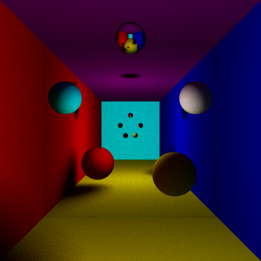

RayTracer

Since I'm using windows 10/11 with Visual Studio 2022 installed, this project has only been tested on those systems.The same goes for the following commands.

Suppose you are in the root directory of this project.

Then:

1.make a new folder named "build":

`
mkdir build
`

2.enter this folder:

`
cd build
`

3.generate the project with cmake

`
cmake ..
`

4.build the project with MSBuild.exe

`
MSBuild.exe .\ray_tracer.sln
`

5.run the exe file

`
.\Debug\ray_tracer.exe
`

6.an image is created in Debug folder

~~g++ -o render *.cpp *.h .\common\*~~

you can get detail of axis from axis.jpg

