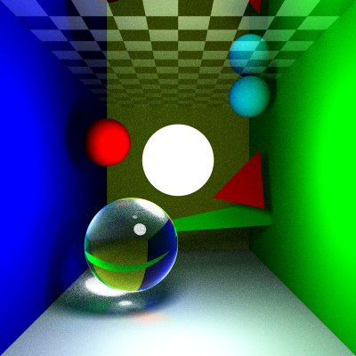

SoftRayTracer
---


**这是一个基于蒙特卡洛算法的软光线追踪渲染器。**

假设你位于该项目的根目录。

接下来:

1.创建一个名为 "build" 的新文件夹。

```
mkdir build
```

2.进入该文件夹。

```
cd build
```

3.使用 CMake 生成项目。

```
cmake ..
cmake --build .
cmake --install .
```

4.然后会在 `bin` 文件夹中生成一个名为 `ray_tracer.exe` 的可执行文件。

5.运行程序后，会生成一张名为 "img.png" 的图像，表示渲染结果。

6.你可以通过修改 `config.cpp` 中的代码来更改场景。

例如:

    SceneType configScene = SceneType::ROOM_TEAPOT;

点击查看单独渲染的图像：
    
- [SceneType::ROOM_SIMPLE](/document/simple_room.png)  
  [](/document/simple_room.png)  
- [SceneType::ROOM_SIMPLE_BUNNY](/document/simple_room_bunny.png)    
  [](/document/simple_room_bunny.png)  
- [SceneType::ROOM_COMPLEX_BUNNY](/document/complex_room_bunny.png)  
  [](/document/complex_room_bunny.png)  
- [SceneType::ROOM_TEAPOT](/document/room_teapot.png)  
  [](/document/room_teapot.png)  
- [SceneType::ROOM_MATERIAL_BALLS](/document/room_material_balls.png)  
  [](/document/room_material_balls.png)  
- [SceneType::ROOM_NORMAL_MAP](/document/room_normal_map.png)  
  [](/document/room_normal_map.png)  


7.由于渲染过程耗时较长，你可以通过修改 `config.cpp` 中的 `resolutionScale` 和 `configSamplersPerPixel` 来调整图像分辨率和采样数。

例如:

    int resolutionScale = 16; // 这种设置较慢但分辨率更高
    int configSamplersPerPixel = 10; // 这种设置较慢但采样更多
---
    int resolutionScale = 2; // 这种设置较快但分辨率较低
    int configSamplersPerPixel = 1; // 这种设置较快但采样较少
---

你可以在 `document` 文件夹中找到更多详细信息（正在编写中...）

参考：[pbr-book.org/4ed/contents](https://pbr-book.org/4ed/contents)

---

---

---

---